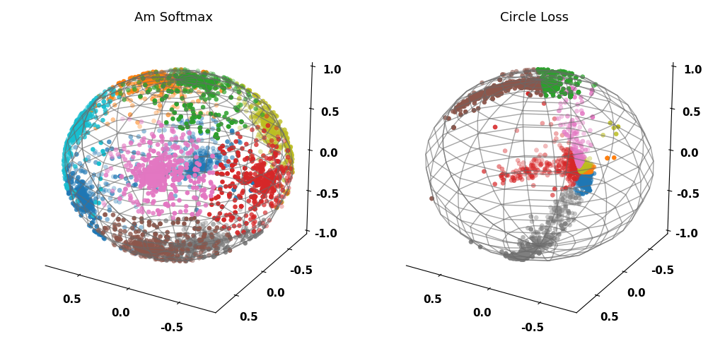

# tf2 Circle Loss implement

An unofficial Tensorflow2 implementation of the paper [Circle Loss: A Unified Perspective of Pair Similarity Optimization](https://arxiv.org/abs/2002.10857)

The interpretation of this paper is recorded in [this blog](https://zhen8838.github.io/2020/04/07/circle-loss/)

Add implementation of the paper [Proxy Anchor Loss for Deep Metric Learning](https://arxiv.org/abs/2003.13911)

The interpretation of this paper is recorded in [this blog](https://zhen8838.github.io/2020/06/17/proxy-anchor/)

- [x] Support class-level labels
- [x] Support Sparse class-level labels
- [x] Support pair-wise labels
- [x] Verified by experiment


# Usage

```python
from circle_loss import SparseCircleLoss, CircleLoss, PairCircleLoss

# General usage
model.compile(
      loss=CircleLoss(gamma=64, margin=0.25),
      optimizer=k.optimizers.Adam(),
      metrics=[k.metrics.CategoricalAccuracy('acc')])
# For Sparse Categorical such as face recognition 
# NOTE need set `batch_size`
model.compile(
      loss=SparseCircleLoss(gamma=64, margin=0.25, batch_size=batch_size),
      optimizer=k.optimizers.Adam(),
      metrics=[k.metrics.SparseCategoricalAccuracy('acc')])
```

**NOTE:** In order to speed up the loss function, `SparseCircleLoss` does not support dynamic `batch_size`. if you need dynamic `batch_size` can refer from [this issue](https://github.com/zhen8838/Circle-Loss/issues/1)

# Experiment

Using cifar10 data set for classification experiment, `circle loss` is  better than [`am softmax loss`](https://arxiv.org/abs/1801.05599). (Python 3.7.4, tensorflow 2.1)

```sh
python ./main.py
Softmax evaluate:
10000/10000 [==============================] - 2s 177us/sample - loss: 1.5902 - acc: 0.7456
Am Softmax evaluate:
10000/10000 [==============================] - 2s 187us/sample - loss: 5.8502 - acc: 0.7727
Circle Loss evaluate:
10000/10000 [==============================] - 0s 40us/sample - loss: 12.5618 - acc: 0.8344
```


You can test loss fuction:

```sh
python ./circle_loss.py
circle loss:
 [ 80.482956 284.16852 62.08397  87.57021 192.4977   87.34067 119.77495 41.9718 ]
sparse circle loss:
 [ 80.48296 284.16852  62.08397  87.57022 192.4977   87.34067 119.77495 41.9718 ]
pair circle loss:
 [ 80.48296 284.16852  62.08397  87.57022 192.4977   87.34067 119.77495 41.9718 ]
```

# Known issues

1.  When I set last Dense layer `unit=3` for visualization emmbeding, I found that when the dimension of **hidden space is small**, the effect of `circle loss` is **very poor**. The effect of `am softmax loss` is reduced.
    
    ```sh
    python ./main_emmbed.py
    Am Softmax evaluate:
    10000/10000 [==============================] - 0s 25us/sample - loss: 8.9257 - acc: 0.7404
    Circle Loss evaluate:
    10000/10000 [==============================] - 0s 29us/sample - loss: 25.2796 - acc: 0.4561
    ```
    It can be found that the classification vector of circle loss is not effectively separated:
    
    
2.  The loss function used for sparse labels on `circle_loss.py line 124` has a numerical overflow problem, **so I used a slower method**. 

    If there is a better method, you can contact me.
    ```python
    def call(self, y_true: tf.Tensor, y_pred: tf.Tensor) -> tf.Tensor:
        idxs = tf.concat([self.batch_idxs, tf.cast(y_true, tf.int32)], 1)
        sp = tf.expand_dims(tf.gather_nd(y_pred, idxs), 1)

        alpha_p = tf.nn.relu(self.O_p - tf.stop_gradient(sp))
        alpha_n = tf.nn.relu(tf.stop_gradient(y_pred) - self.O_n)
        alpha_n_for_p = tf.expand_dims(tf.gather_nd(alpha_n, idxs), 1)

        r_sp_m = alpha_p * (sp - self.Delta_p)
        r_sn_m = alpha_n * (y_pred - self.Delta_n)
        _Z = tf.concat([r_sn_m, r_sp_m], 1)
        _Z = _Z * self.gamma
        # sum all similarity
        logZ = tf.math.reduce_logsumexp(_Z, 1, keepdims=True)
        # remove sn_p from all sum similarity
        # TODO This line will be numerical overflow, Need a more numerically safe method
        logZ = logZ + tf.math.log(1 - tf.math.exp(
            (alpha_n_for_p * (sp - self.Delta_n)) * self.gamma - logZ))

        return -r_sp_m * self.gamma + logZ
    ```
